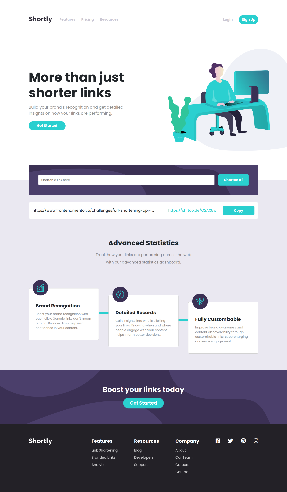

# Frontend Mentor - Shortly URL shortening API Challenge solution

This is a solution to the [Shortly URL shortening API Challenge challenge on Frontend Mentor](https://www.frontendmentor.io/challenges/url-shortening-api-landing-page-2ce3ob-G). Frontend Mentor challenges help you improve your coding skills by building realistic projects.

## Table of contents

- [Overview](#overview)
  - [The challenge](#the-challenge)
  - [Screenshot](#screenshot)
  - [Links](#links)
  - [Built with](#built-with)
  - [Running the App Locally](#running-the-app-locally)
- [Author](#author)

## Overview

### The challenge

Users should be able to:

- View the optimal layout for the site depending on their device's screen size
- Shorten any valid URL
- See a list of their shortened links, even after refreshing the browser
- Copy the shortened link to their clipboard in a single click
- Receive an error message when the `form` is submitted if:
  - The `input` field is empty

### Screenshot



### Links

- Solution URL: [Code on Github](https://github.com/sn-tin/shorten-url)
- Live Site URL: [Deploy on Vercel](https://your-live-site-url.com)

### Built with

- HTML5
- Sass (CSS pre-processor)
- Bootstrap 5.2 (CSS framework)
- Flexbox
- Mobile-first workflow
- Vanilla JavaScript
- [Webpack](https://webpack.js.org/) - Webpack
- [Fontawesome](https://fontawesome.com/) - Font Awesome for Icons
- [Goole Fonts](https://fonts.google.com/knowledge) - Google Fonts

### Running the App Locally
This app runs on Node.js. If Node.js is installed, you may clone the repository and install its dependencies running:
```
npm install
```

## Author

- Frontend Mentor - [@sn-tin](https://www.frontendmentor.io/profile/sn-tin)
- Github - [@sn-tin](https://github.com/sn-tin/)
